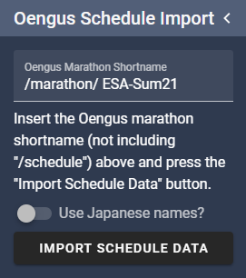
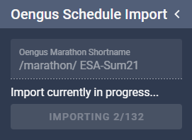
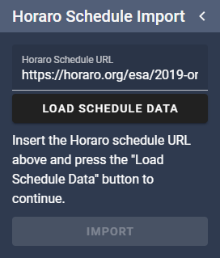
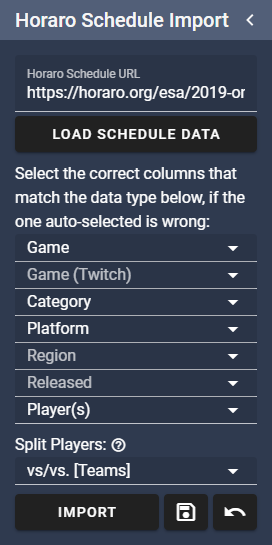
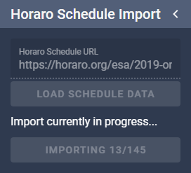

# nodecg-speedcontrol


*This is a bundle for [NodeCG](https://nodecg.dev/); if you do not understand what that is, we advise you read their website first for more information.*

nodecg-speedcontrol, usually known as just "Speedcontrol", is a bundle for the [NodeCG](https://nodecg.dev/) broadcast graphics framework/application developed for automating tasks for speedrunning marathons, mainly changing information on overlays and updating the Twitch information.

Some basic information:
- Import schedules from [Horaro](https://horaro.org/) and [Oengus](https://oengus.io/).
- By default, can store information on the run and the players, and can also be customised to store more than the default if needed by advanced users.
- Automatically change Twitch title and/or game directory if needed.
- Automatically feature the current player(s) on the [FrankerFaceZ](https://www.frankerfacez.com/) featured channels function below the stream.
- Has an inbuilt timer (powered by [livesplit-core](https://github.com/LiveSplit/livesplit-core)); no need to have a seperate application open.
- Support for some donations trackers can be added with extra bundles (see below).
- User interface available in English and Japanese.

This bundle doesn't come with any graphics, you will need to create them yourself in another bundle. If you have no experience in developing, you can check out [speedcontrol-simpletext](https://github.com/speedcontrol/speedcontrol-simpletext) for an simple example bundle, or check out the [API documentation](READMES/API.md) if you're are more advanced user.


## Table of Contents

- [Installation](#installation)
  - [tl;dr installation](#installation-tldr)
- [Basic Usage](#basic-usage)
  - [Importing a Schedule](#importing-a-schedule)
    - [Oengus](#oengus)
    - [Horaro](#horaro)
  - [Selecting Runs/Using the Timer](#selecting-runs-timer)
  - [Twitch Control Login](#twitch-control-login)
- [Extra Support Bundles](#extra-support-bundles)
- [Where has this bundle been used before?](#previous-usage)
- [Authors/Contributors](#authors-contributors)
- [Contribution/Development](#contribution-development)
  - [Localisation](#localisation)


## Installation

You will need [Node.js](https://nodejs.org) (16.x LTS tested) and [git](https://git-scm.com/) installed to install NodeCG, then see the [NodeCG documentation](http://nodecg.dev/) on how to install that. I also suggest installing `nodecg-cli`; information on that is also on the documentation just linked.

- `nodecg install speedcontrol/nodecg-speedcontrol` to install the latest version of nodecg-speedcontrol

This bundle can run without any extra configuration, but it's needed to use all of the functionality, and if you want to switch to a different localisation. Please see the [Configuration documentation](READMES/Configuration.md) for more information. You may also want to read the [Schedule Formatting documentation](READMES/Schedule-Formatting.md) for advice on formatting your Horaro schedules before importing, if you choose to import via this method.


<a id="installation-tldr"></a>
### tl;dr installation

Install [Node.js](https://nodejs.org) (16.x LTS tested) and [git](https://git-scm.com/), then make a folder anywhere and open a command prompt/shell/bash window, then run these commands in order:

```
npm install nodecg-cli -g
nodecg setup
nodecg install speedcontrol/nodecg-speedcontrol
nodecg start
```


## Basic Usage

Once installed, go to `https://localhost:9090` (unless you have overridden the defaults in the NodeCG config) to access the dashboard.

### Importing a Schedule

To import a schedule, start by going to the *Run Modifications* workspace along the top.

#### Oengus

If you are importing a schedule from Oengus, this part is pretty simple. Paste in the shortname of the marathon (the part at the end of the Oengus URL) into the box (it will be automatically pre-filled if you set `oengus.defaultMarathon` in this bundle's config), toggle "Use Japanese names?" if needed (will be automatically pre-set if you set `oengus.useJapanese` in the bundle's config) and click *Import Schedule Data* button. There will be an alert dialog to confirm you want to proceed as well.



The schedule will begin importing. If you have the speedrun.com lookup enabled (by default it's enabled) this import may take a while, so be patient. Once the import is done, this panel will turn back to how it was before, and the runs will be listed in the *Run Player* and *Run Editor* panels.



#### Horaro

To import a schedule, go to the *Run Modifications* workspace along the top, and look for the *Horaro Schedule Import* panel. Paste in a Horaro schedule URL into the text box (it will be automatically pre-filled if you set `horaro.defaultURL` in this bundle's config) and click *Load Schedule Data*.



Next you will see a list of dropdowns. These are used to select which columns in your schedule relate to which information in the run data. The import tries to automatically select the appropriate columns, but if something is wrong you can change it here. Also available here is an option on how the players in the *Players* column should be split; see the [Schedule Formatting documentation](READMES/Schedule-Formatting.md) for more information on what these options mean and how the *Players* column data should be formatted.
Once you have everything selected correctly, click on the *Import* button. There will be an alert dialog to confirm you want to proceed as well.



The schedule will begin importing. If you have the speedrun.com lookup enabled (by default it's enabled) this import may take a while, so be patient. Once the import is done, this panel will turn back to how it was before, and the runs will be listed in the *Run Player* and *Run Editor* panels.



<a id="selecting-runs-timer"></a>
### Selecting Runs/Using the Timer

To start "playing" runs, go back to the *Main Workspace* and find the *Run Player* panel, and click on the big "▶ [GAME]" button at the top.


Next to the above panel should be the *Run Timer* panel. This should be very self explanitory; use the play button to start the timer, use the tick button to stop it or use the cross button if the player has to forfeit the run. You can also reset it if needed, pause it, undo a stop if done accidentally and also click inside the timer box, type and press enter to edit the time if needed for any reason. The timer changes slightly for races, but is easy to figure out as each team gains their own set of stop/forfeit/undo buttons.


### Twitch Control Login

If you have enabled the Twitch integration in this bundle's config, there will be a panel in *Main Workspace* called *Twitch Control*, which will have a button to set up the connection with Twitch. Use this to connect the application to your Twitch account.


Once you have done the above, make sure to turn the auto-sync on in the panel, otherwise it will not be done when you change runs. You can also manually update the title, game and the Twitch usernames for the FrankerFaceZ featured channels integration if you have this enabled.


## Extra Support Bundles

Alongside the main bundle, there are some extra bundles that either we or third parties maintain that you may also want to use for speedrunning marathons. See their GitHub pages for more detailed information on how to use them. Be warned that some may be somewhat undocumented as of now.

To easily install: `nodecg install BUNDLE`, where `BUNDLE` is the full name below.
- [speedcontrol/speedcontrol-tiltify](https://github.com/speedcontrol/speedcontrol-tiltify): Adds a frequently updating donation total amount for a Tiltify campaign you can use in your layouts.
- [speedcontrol/speedcontrol-srcomtracker](https://github.com/speedcontrol/speedcontrol-srcomtracker): Adds frequently updating donation total/goals/bidwars and messages for new donations for a marathon on [speedrun.com](https://www.speedrun.com) if they are enabled, that you can use in your layouts.
- [speedcontrol/speedcontrol-flagcarrier](https://github.com/speedcontrol/speedcontrol-flagcarrier): Adds a server and replicants that can receive requests from ESA's [FlagCarrier android app](https://play.google.com/store/apps/details?id=de.oromit.flagcarrier) so this information can be used in your layouts.
- [nicnacnic/speedcontrol-layouts](https://github.com/nicnacnic/speedcontrol-layouts): A base pack of layouts for anyone to customize. Includes Tiltify support for donation totals, incentives, and prizes, layout Photoshop files, and detailed documentation for all your customization needs.
- [nicnacnic/speedcontrol-tweetr](https://github.com/nicnacnic/speedcontrol-tweetr): Control Twitter right from your NodeCG dashboard!


<a id="previous-usage"></a>
## Where has this bundle been used before?

*(This is not an exhaustive list.)*

- All [European Speedrunner Assembly](https://www.esamarathon.com/) marathons since Pre-ESA Marathon 2016, including the ESA ran Dreamhack speedrunning events in Sweden
- Most [United Kingdom Speedrunner Gathering](https://www.speedrun.com/uksg) marathons since Fall 2018.
- All [GTA Marathons](https://www.twitch.tv/gtamarathon) since GTA Marathon 2016
- All [SpeedSouls Charity Marathons](https://www.twitch.tv/speedsouls)
- [Themeathon Pre-Marathon 2018](https://www.twitch.tv/themeathon)
- Several [Voltathon](https://www.twitch.tv/voltagegg) marathons
- [DegenDash](https://www.twitch.tv/degendash)
- Some marathons on [The Fast Force](https://www.twitch.tv/thefastforce) Twitch channel
- [A Race Against Time 3](https://www.twitch.tv/araceagainsttime)
- [Power Up With Pride](https://www.twitch.tv/powerupwithpride) since Winter Pride 2018
- [Bingothon](https://bingothon.com/)
- [BSG Marathon](https://twitch.tv/bsg_marathon) 1-15 and from @Home and forwards.
- [No Glitches Allowed](https://twitch.tv/speedrunslive) since No Glitches Allowed 4
- [Completithon](https://twitch.tv/completithon) since Completithon 2019
- [MDSR Summer '21](https://twitch.tv/ModernDOOMSpeedrunning)


<a id="authors-contributors"></a>
## Authors/Contributors

Originally developed by Charleon, now mainly developed by zoton2.

With help and contributions from:
- btrim
- Zephyyrr
- Planks
- cma2819 *(Oengus Support)*
- yagamuu *(Japanese Localisation)*


<a id="contribution-development"></a>
## Contribution/Development

If you install from the latest release (for example, with `nodecg-cli` by doing `nodecg install speedcontrol/nodecg-speedcontrol`) you will get the latest stable build.

If you wish to help with further development, the `master` branch is where all the development is done, although you will need to install all dependencies (`npm install`) and build (`npm run build`) to actually use the bundle, and see any changes you make.

If you wish to test/use experimental unfinished features without needing to build yourself, there is a `build` branch which should usually mirror the `master` branch but has everything built already so you should only need to install production dependencies (`npm install --production`).

The `dev` branch is a legacy branch; it used to be used for current development but that has now all moved to the `master` branch.

The `v1.x` branch is a legacy branch for that version; this exists for archival purposes, as the strucutre was highly different.

If you need to report an issue, you can [do that on GitHub](https://github.com/speedcontrol/nodecg-speedcontrol/issues).

Feel free to raise an issue/Pull Request if you have used our bundle(s) for a marathon and would like to be linked above.


### Localisation

This bundle supports additional languages using [Vue I18n](https://kazupon.github.io/vue-i18n/). If you wish to add support for another language, you must add the language code in `configschema.json`, under `language` > `enum`, and then also run `npm run schema-types` to regenerate the `src\types\schemas\configschema.d.ts` file. You can then specify this language in the bundle's configuration file. Then, in the `src\dashboard\_misc\i18n.ts` file, add an additional object inside of the `messages` object inside the `VueI18n` instance for your newly added language. There are some reused pieces of text in this file that should be translated, but the rest are stored in the Single File Components (SFC) inside of the `src\dashboard` folder and subfolders, within the `<i18n>` blocks inside of those (in JSON format). If a piece of text is not translated yet, it will fall back to English (`en`).
